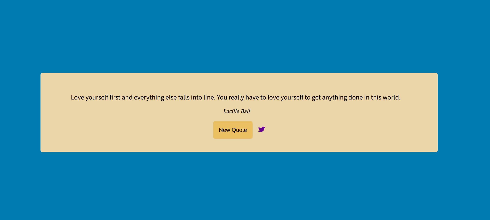

# Quote Machine App

This app is a Quote Machine app. As soon as it loads you will see a quote from a famous person. If you click New Quote you will have a new one! Have fun discovering quotes. The app uses the API [quotable](https://github.com/lukePeavey/quotable) to fetch the quotes.

## Live Preview

[Quotable Machine](https://javierbotero.github.io/quote-machine/)



## Built With

- React
- Redux
- Javascript
- CSS
- Node
- Yarn

## Getting start

To start with the project:

1. Install npm in your machine.

2. Clone [this repository](https://github.com/javierbotero/FunCourses.git)

3. cd inside the project

4. Run in the terminal
```
  yarn
```
in the terminal to install the dependencies.

5. Run in the terminal
```
  yarn start
```
And you will have the Fun Courses locally.

👤 **Javier Botero**

- Github: [@Javierbotero](https://github.com/javierbotero)
- Twitter: [@Javierbotero1](https://twitter.com/Javierboterodev)
- Linkedin: [Javierbotero](https://www.linkedin.com/in/javierboterodev/)


## 🤝 Contributing

Contributions, issues, and feature requests are welcome!

## Show your support

Give a ⭐️ if you like this project!
